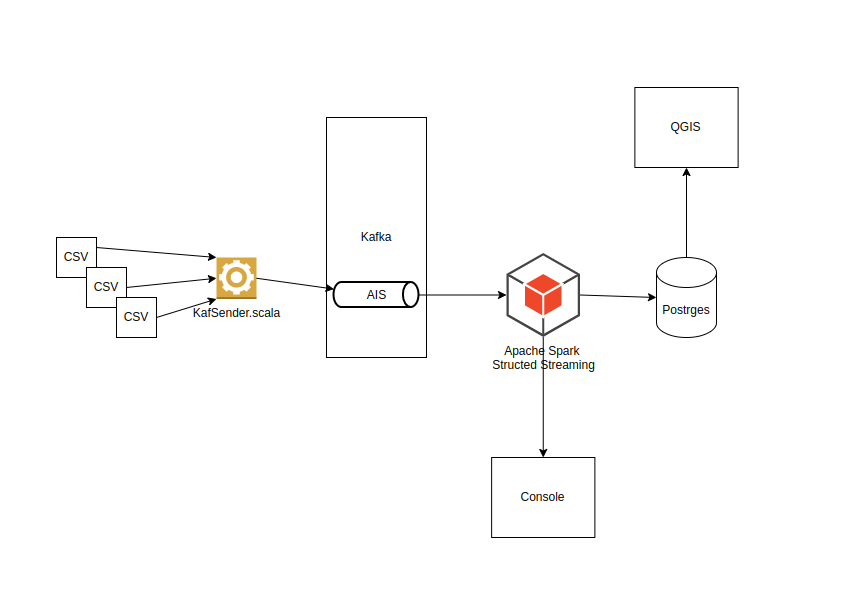
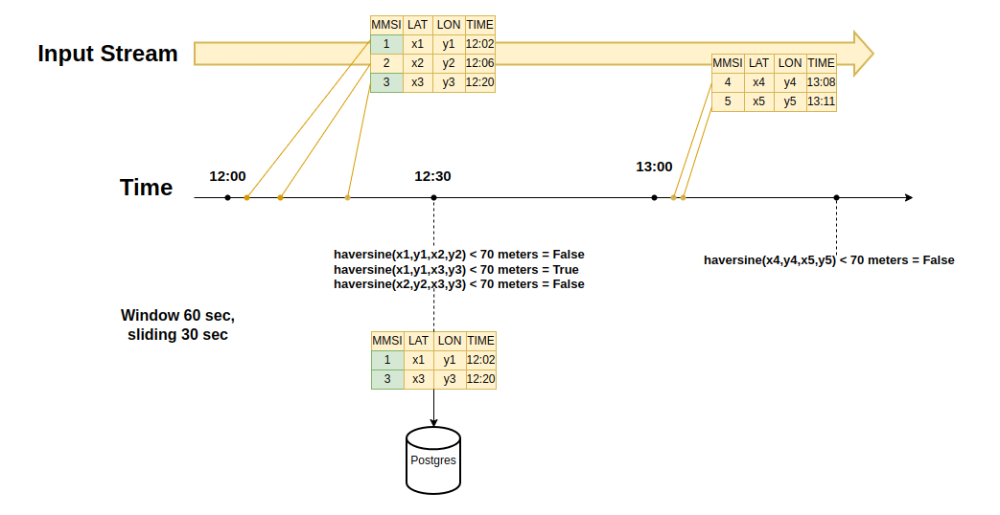
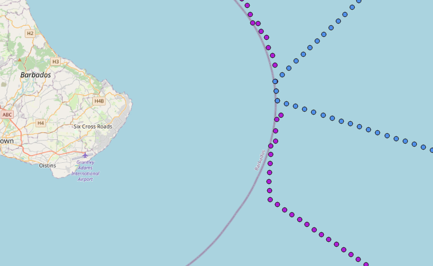
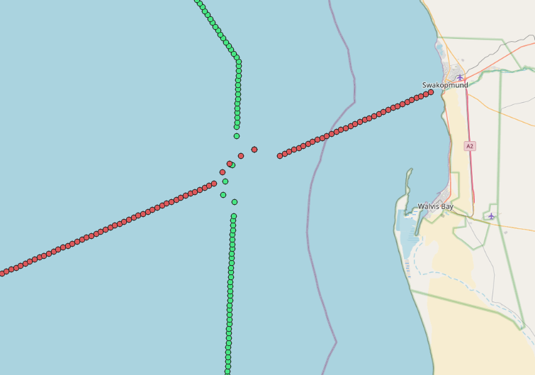

# Проектная работа.
# Обнаружение сближения судов на основе данных АИС (Автоматическая идентификационная система)

Автоматическая идентификационная система (англ. AIS Automatic Identification System) была внедрена в морской сфере 
для повышения безопасности морского судоходства. Сообщения АИС передаются в виде с помощью радиоволн диапазона УКВ на ближайшие суда
и содержат, среди прочего, информацию об идентификации, местоположении, скорости и курсе передающих судов.
Таким образом, АИС может служить инструментом для предотвращения столкновений и повышения ситуационной осведомленности.
В последние годы собраные данные АИС используется во все большем количестве приложений, поскольку они позволяет осуществлять глобальное 
наблюдение практически за любым более крупным судном. Примером приложения, использующего данные АИС является сайт
https://www.marinetraffic.com/  
Пример данных АИС  
```agsl
MMSI,BaseDateTime,LAT,LON,SOG,COG,Heading,VesselName,IMO,CallSign,VesselType,Status,Length,Width,Draft,Cargo,TransceiverClass
367702220,2022-03-31T00:00:01,29.78763,-95.08070,0.1,226.5,340.0,JOE B WARD,,WDI4808,31,12,21,8,,57,A
671226100,2022-03-31T00:00:01,25.77626,-80.20320,3.2,143.7,511.0,RELIANCE II,IMO9221322,5VHS7,79,0,52,12,2.5,70,A
367767250,2022-03-31T00:00:01,29.31623,-94.78829,4.5,228.1,511.0,GLEN K,,WDJ3358,52,0,0,0,0.0,52,A
338327436,2022-03-31T00:00:03,47.29634,-122.42233,0.0,360.0,511.0,COOL KAT,IMO0000000,,36,,15,3,,,B
367452810,2022-03-31T00:00:06,29.32824,-94.77391,2.6,319.2,511.0,JOHN W JOHNSON,IMO9602344,WDF4516,60,0,80,19,3.0,60,A
```

Аномалии в треках AIS могут указывать на события,которые имеют отношение к безопасности.  
Пример такой аномалии - сближение судов.  
Длительные близкие сближения судов, как правило, должны быть редкими, за исключением, например, чрезвычайных ситуаций.
В противном случае они могут быть признаком незаконной деятельности, такой как обмен контрабандой и/или наркотиками.  
**В данной работе мы рассмотрим поиск таких аномалий с помощью Apache Spark Structured Streaming.** 
Почему Apache Spark?  
Данные AIS - это действительно Big Data)  
Для примера, всего лишь один файл, охватывающий один день морского движения вокруг Дании имеет размер около 2 ГБ и содержит около 10 миллионов записей 
о местоположении судов. Это означает, что месячный объем данных составляет около 60 ГБ, а годовой объем данных составляет около 700 ГБ,
что охватывает более 3 миллиардов точек данных.
  
Kafka будем использовать в качестве шины данных.  
Postgres c расширением Postgis для хранения данных.  
Qgis для визуализации.
  
### Стек:
- Spark
- Kafka
- Postgres(PostGis)
- QGIS

### Схема проекта  


## Подготовка

1. Запускаем Kafka
    ````
    cd kafka
    docker compose up -d
    ````  
2. Запускаем Postgres(PostGis)
    ````
    docker run -d \
	--name postgismy2 \
	-p 5455:5432 \
	-e POSTGRES_PASSWORD=mysecretpassword \
	-e PGDATA=/var/lib/postgresql/data/pgdata \
	-v /home/vadim/MyExp/Diplom/PGDATA:/var/lib/postgresql/data \
	postgis/postgis:14-3.3-alpine
    ````
3. Установка QGIS(Ubuntu)
    ````
    https://qgis.org/ru/site/forusers/alldownloads.html#debian-ubuntu
    ````
4.  Spark запускаем в локальном режиме, используя все ядра машины.

К сожалению, в бесплатном доступе есть данные AIS, охватывающие прибрежные территории, публикуемые либо энтузиастами либо
таким организациями  как https://coast.noaa.gov/  
Данные судов,находящихся в открытом море, на значительном удалении от берега имеют возможность получать лишь спутники.
Это существено сказывается на стоимости этих данных, поэтому мы будем использовать синтетические данные.  
С помощью https://www.nmeagen.org/ я сгененерировал 10 морских маршрутов:  
- New-York(USA) -> Galway(Ireland)
- Miami(USA) -> Lisbon(Portugal)
- Charleston(USA) -> Cardiff(England)
- Bridgetown(Barbados) -> Portsmouth(England)
- Pointe-a-Pitre(Guadeloupe) -> Le Havre(France)
- San Juan(Puerto Rico) -> Bilbao(Spain)
- Norfolk(USA) -> Tanji(Gambia)
- Guanta(Venezuela) -> Natal(Brazil)
- Buenos Aires(Argentina) -> Swakopmund(Namibia)
- Cape Town(South Africa) -> Amsterdam(Netherlands)  

Сохранив эти маршруты в виде csv файлов в папке resources проекта. Файлы представляют собой записи
такого вида  
```agsl
13.090848157714122,-59.6389389038086
13.07899366618084,-59.63056611396681
13.06713917464756,-59.622193324125014
13.055284683114278,-59.61382053428322
13.048217974298048,-59.60095434999205
13.041151265481817,-59.58808816570088
```
где первая цифра это широта, вторая долгота. Эти файлы теперь необходимо превратить в формат АИС, вида:
```agsl
MMSI,BaseDateTime,LAT,LON,SOG,COG,Heading,VesselName,IMO,CallSign,VesselType,Status,Length,Width,Draft,Cargo,TransceiverClass
367702220,2022-03-31T00:00:01,29.78763,-95.08070,0.1,226.5,340.0,JOE B WARD,,WDI4808,31,12,21,8,,57,A
```
Для поиска сближений нам можно не заполнять все поля, а заполнить только  
- MMSI (Maritime Mobile Service Identity) — это уникальный девятизначный номер для идентификации судна.
- LAT широта
- LON долгота  

Для конвертации написан класс **utils.CreateCsv**. В папке resources/transformations находятся сконвертированые файлы.  
Теперь необходимо создать топик в кафке куда мы будем отправлять данные с этих файлов, имитируя реальное поступление этих данных,
с идущего судна.  
```agsl
./kafka-topics.sh --bootstrap-server=localhost:29092 --list
./kafka-topics.sh -create -topic ais -bootstrap-server localhost:29092
```
Далее в постгресе создаем следующие сущности  
```
--Таблица приемник "сырых" данных, пишутся все данные пришедшие в топик без изменения 
create table ais_data (
                      MMSI Int,
                      BaseDateTime varchar(255),
                      LAT double precision,
                      LON double precision,
                      SOG numeric,
                      COG numeric,
                      Heading numeric,
                      VesselName varchar(255),
                      IMO varchar(255),
                      CallSign varchar(255),
                      VesselType int,
                      Status int,
                      Length numeric,
                      Width numeric,
                      Draft numeric,
                      Cargo int,
                      TransceiverClass varchar(255)
)
```  
```
-- Таблица с обнаруженными сближениями судов, где haversine расстояние между точками
create table catched (
	MMSI1 Int,
	MMSI2 Int,
	haversine numeric
)
```  
````
-- Вьюшка для визуализации полных маршрутов кораблей в QGIS
CREATE VIEW anomaly_routes_view
 AS
 SELECT ais_data.mmsi,
    st_point(ais_data.lon, ais_data.lat) AS loc
   FROM ais_data
  WHERE (ais_data.mmsi IN ( SELECT catched."MMSI1"
           FROM catched));
````

## Запуск

Данные АИС из файлов-маршрутов в папке resources/transformations мы будем слать в топик ais.  
Что бы сымитировать реалное получение данных по времени но и не ждать много дней), сделаем
финт.  
- Данные каждого маршрута записывются в топик параллельно.  
- Задержка между записью каждой строки будет  3\*60\*1000)/кол-во строк в файле, что бы размазать по времени
- BaseDateTime время отправки данных(время события) будет текущее время минус 1-2 секунды, это для того чтобы слишком большое кол-во записей не имело одинаковое время

Так получится, что за 3 минуты у нас в топик попадут все маршруты.  
Для этого был написан класс **utils.KafSender**
### Логика работы спарк приложения
У нас будет скользящее окно длительностью 60 секунд со смещением 30 секунд.  
Все записи попавшие в это окно мы будем считать легитимными для расчетов(
Логика тут вот в чем - если два судна в течении двух часов, например, передали близкие координаты, нам это нужно отследить.
Но если сделать это окно слишком широким, например 24 часа, можно получить слишком много срабатываний,например суда шли друг за другом по стандартному морскому пути с интервалом 8 часов 
)  
Для расчета расстояния между координатами будем использовать формулу Гаверсинуса, возращающую результат в метрах.  
Схема:  
  

- Все записи, считаные с топика ais, без изменений пишем в таблицу ais_data
- Все записи окна проверяем между собой с помощью формулу Гаверсинуса, если обнаружим, что есть точки расстояние между которыми
меньше *70 метров*, то данные MMSI,LAT,LON,haversine(расстояние) мы запишем в таблицу catched
  
Приложение находится в классе kapp.Kappy  
## Визуализация  

Для визуализации будем использовать QGIS  
Подключаем в качестве источника наш постгрес с постгисом  и в качестве слоя данных вьюшку
anomaly_routes_view. Добавим расцветку разных маршрутов(свойства->стиль->символизация по уникальным значениям)  
Сохраненный проект в папке Qgis.  
Пойманные аномалии:
  
  


  
